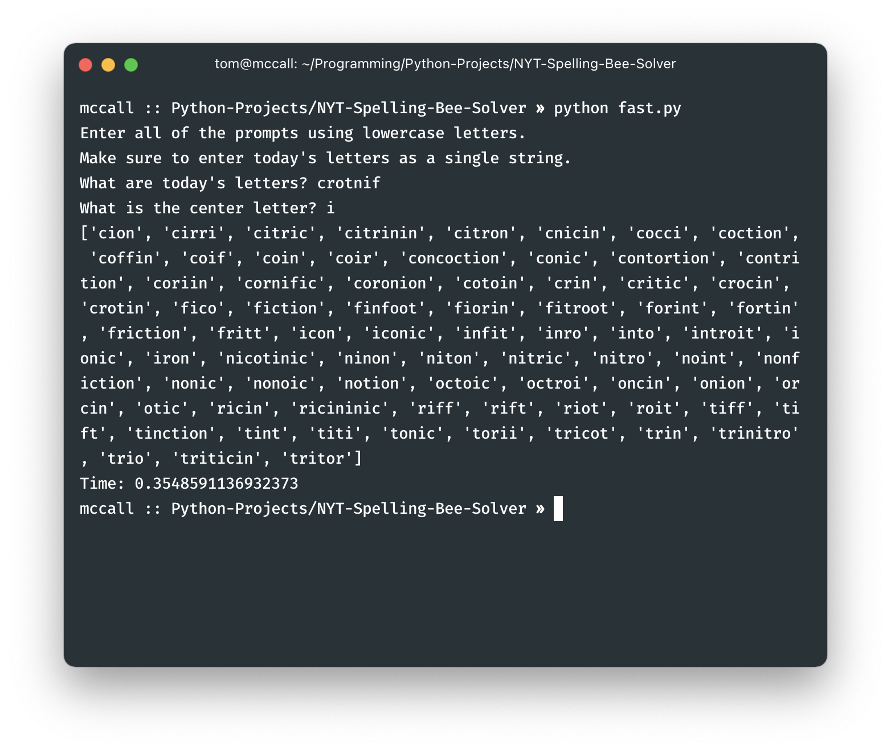
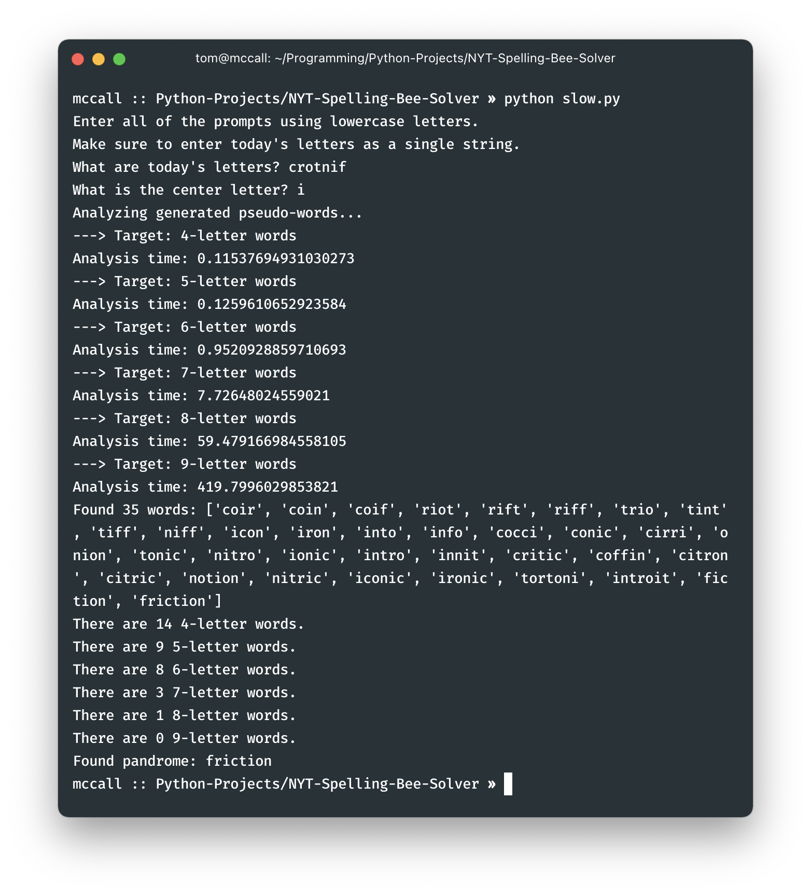

# NYT Spelling Bee Solver
A short program that finds (almost) every possible solution to the daily NYT Spelling Bee puzzle.

Note that neither method is guaranteed to find all possible solutions, due to
the inconsistency of the various dictionaries available. The fast method often
includes a lot of words that won't be accepted by NYT. The slow method doesn't
include as many false positives, but it also isn't guaranteed to find every word (dictionaries are surprisingly inconsistent!).

There are two methods included:
### 1. Fast (~ 0.5 seconds)
The fast method uses the native text-based dictionary present on all Unix systems. The algorithm
sifts through all of the words, filtering out words that:
- don't contain the center letter
- don't have four or more letters
- have letters that aren't in the accepted letters list

To double-check, the algorithm then verifies the solutions using `pyenchant`.
#### Example output

### 2. Slow (~ 8 minutes)
The slow algorithm uses two python libraries: `itertools` and `pyenchant`, and it's simple:
- Input a list of letters, specifying which letter is in the center (i.e., which letter must be in every word)
- Generate all possible combinations of the given letters, from lengths 4 to 9
- Filter all of the generated words using pyenchant

This algorithm is slower than the fast algorithm, because the number of possible letter combinations
in this case is equal to `7^4 + 7^5 + 7^6 + 7^7 + 7^8 + 7^9`, or `47,078,808` (Note that I'm stopping at
9-letter words, because it'd take forever to check the 10-letter words). A basic dictionary,
on the other hand, contains far fewer words: there are only 235,886 words in the edition of the Merriam Webster
dictionary used in the "fast" algorithm.

#### Example output

